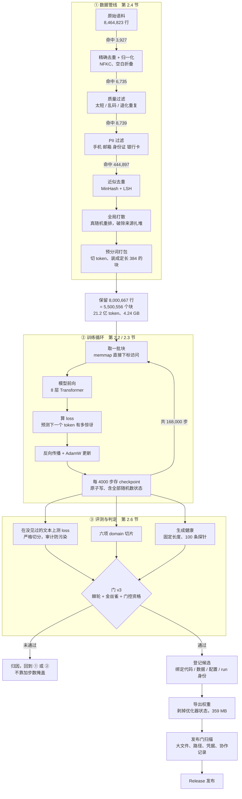
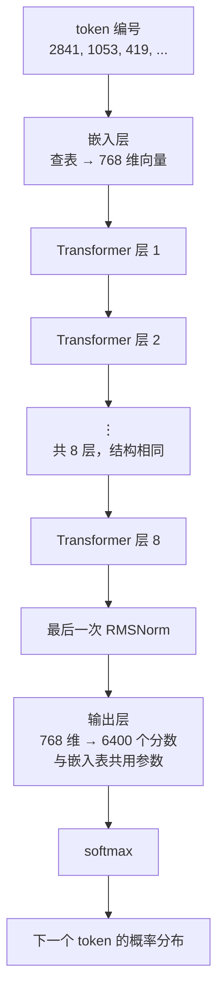
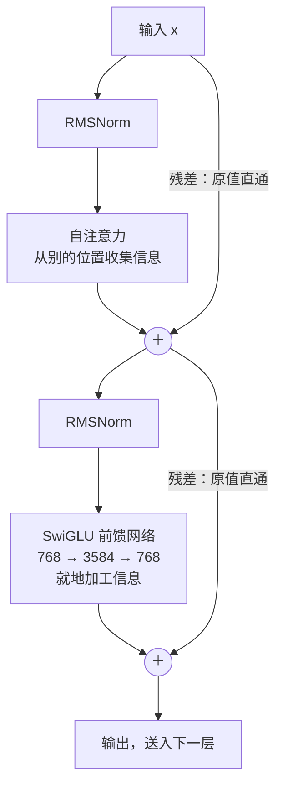
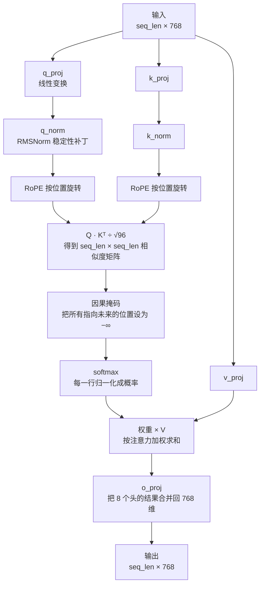
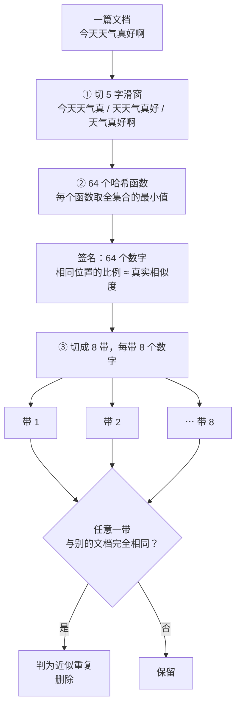
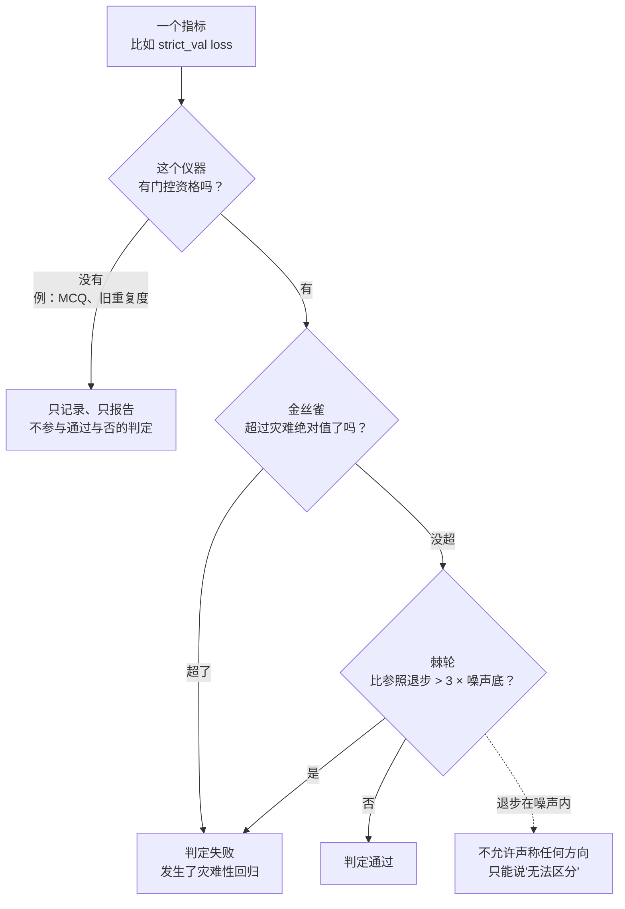
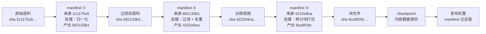
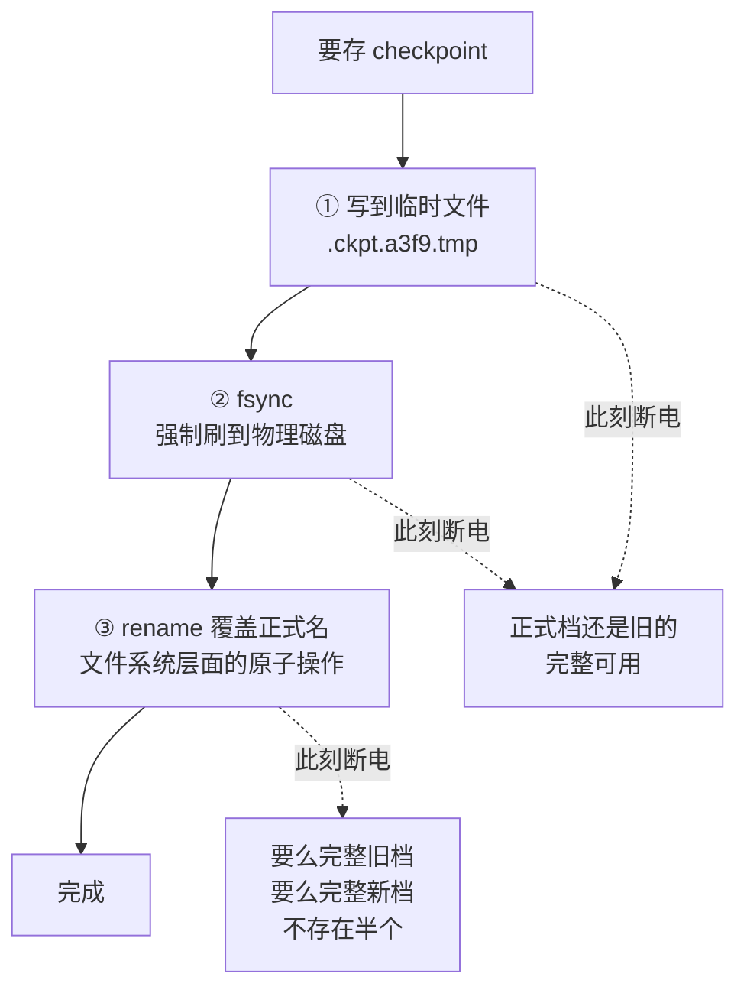

# 预训练是怎么做出来的：从零讲起

这份文档写给**没有接触过大模型训练的同学**。不需要你懂深度学习，只需要你会看
表格和读一点点公式。读完你应该能回答三个问题：我们做了个什么东西、它是怎么做
出来的、它现在到底行不行。

术语第一次出现时都会解释。你可以跳着读——算法篇和 Infra 篇互相独立。

---

## 0. 五分钟速览

我们训练了一个**语言模型的"基座"**：8,986 万个参数，主要吃中文，能续写文本。

打个比方：如果最终目标是造一个能对话的助手，那么

- **预训练**（我们做的）= 让它把语言本身学会，像小孩听了几年话，能接话茬了；
- **SFT / 对齐**（后续阶段）= 教它"被提问时要回答"，把接话茬变成对话。

所以**现在这个模型不会听指令**。你给它"帮我写封邮件"，它可能续写成
"帮我写封邮件的格式是这样的……"——它在续写，不在应答。这不是 bug，是阶段。

产出物：两份权重文件（各 359 MB），挂在仓库 Release 里。为什么是两份？后面
第 2.6 节讲。

### 全流程一张图

从一堆网上扒来的原始文本，到一个可以发布的模型，中间是这样一条流水线。**先看
整体形状，细节后面每一节展开。**



三个分组对应本文三个部分：数据（第 2.4 节）、训练（第 2.2–2.3 节）、评测
（第 2.6 节）。贯穿它们的 Infra——身份、恢复、监控、准入、纪律工具——在第 3 章。

> 图中各阶段的"命中"数是**该规则判定的行数**，加起来（460,371）略多于实际删除的
> 460,229 行——因为同一行可能同时命中多条规则，只会被删一次。原始 8,464,823 行，
> 最终保留 8,000,667 行，总丢弃率 5.44%。**这种小数字对不上的地方要主动说明，
> 不然读者只能猜是谁算错了。**

---

## 1. 我们到底训了个什么

### 1.1 语言模型在做的唯一一件事

**预测下一个词。** 就这一件事。

给它"今天天气真"，它输出一个概率分布：

| 下一个字 | 模型给的概率 |
| --- | ---: |
| 好 | 0.41 |
| 不 | 0.12 |
| 冷 | 0.09 |
| 香 | 0.00003 |
| …（还有 6396 个候选） | … |

训练就是拿海量真实文本，一个位置一个位置地问它"下一个是什么"，然后按它猜得多
离谱来调整它的参数。

**为什么这么简单的目标能学出智能？** 因为要把"下一个词"猜准，你被迫学会一大堆
东西。想猜对"中华人民共和国的首都是北___"，你得知道这个事实。想猜对
"他把钥匙放在桌上，然后出门了。回来后他从___上拿起钥匙"，你得追踪状态。想猜对
代码里的 `for i in ra___`，你得懂语法。**压缩即理解**——为了用更少的"惊讶"预测
文本，模型不得不在参数里建立起关于世界的结构。

### 1.2 loss：模型有多"惊讶"

训练时唯一实时看的数字叫 **loss**（损失）。它衡量模型的惊讶程度：正确答案模型
给的概率越低，loss 越高。

我们用的单位叫 **nats**。换算关系很直观：

$$\text{loss} = -\ln(\text{模型给正确答案的概率})$$

举几个锚点，帮你建立数感（我们词表有 6,400 个 token）：

| 情况 | 正确答案的概率 | loss |
| --- | ---: | ---: |
| 完全瞎猜（6400 选 1） | 1/6400 | **8.76** |
| 我们训练开始时 | ~1/6400 | 8.7 左右 |
| 我们最终模型 | ~18% | **1.72** |
| 完美预测（不可能） | 100% | 0 |

**所以 1.72 的含义是：在完全没见过的文本上，模型平均把正确答案的概率压到了
18% 左右。** 从瞎猜的 1/6400 到 1/5.6，这就是训练买到的东西。

⚠️ 一个新手最容易掉的坑：**loss 只在同一个 tokenizer 下可比**。tokenizer 是把
文字切成 token 的规则（下一节讲）。切法不同，"预测一个 token"的难度就不同，
loss 数字互相之间毫无意义。我们后面栽在这上面过一次，第 4.3 节讲。

---

## 2. 算法篇

### 2.1 tokenizer：先把字变成数字

计算机不认识"你好"，只认识数字。**tokenizer** 就是那本字典，把文本切成片段
（token）再映射成整数编号。


从这里开始，模型眼里就没有"字"了，只有向量。**训练要做的，就是把这张嵌入表和
后面 8 层的参数一起调好，让向量之间的几何关系恰好编码了语言的规律。**

我们的词表有 **6,400** 个 token。这个数字很小（GPT-4 级别的模型通常 10 万以上），
原因是模型本身就小——词表越大，模型光是记住每个 token 长什么样就要花掉越多参数。

我们**直接复用了上游 MiniMind 项目的 tokenizer**，没有自己训。这个决定在第 4.3
节会变得很重要。

### 2.2 模型结构：数据从进到出走了什么路

我们的模型是 **Transformer 解码器**（decoder-only），和 GPT 系列同一族。整体
8 层，每层结构完全一样。



**一层里面长这样**——两条支路，每条都是"先归一化、再计算、再加回原值"：



两条**残差直通**是深层网络能训起来的关键：就算某一层暂时算得一团糟，原始信息也
能原样穿过去，不会被毁掉。

下面把各个部件逐个拆开。

#### 嵌入层（Embedding）

一张 6400 × 768 的大表。token 编号 2841 就去查第 2841 行，得到一个 768 个数字
组成的向量。这 768 个数字就是模型对这个 token 的"理解"，训练中会不断调整。

768 这个数叫 **hidden size**（隐藏层宽度），是模型"思考带宽"的度量。

#### 自注意力（Self-Attention）：让每个词回头看

这是 Transformer 的核心。直觉是：**理解一个词，必须看它的上下文**。

"苹果"在"我吃了个苹果"里是水果，在"苹果发布了新手机"里是公司。模型怎么区分？
让"苹果"这个位置**回头看**前面所有词，自己决定该关注谁。

具体做法：每个位置生成三个向量，用查资料打比方——

- **Query（查询）**：我想找什么？
- **Key（键）**：我是什么，能被谁找到？
- **Value（值）**：如果被找到了，我贡献什么信息？

每个位置拿自己的 Query 去和所有位置的 Key 做点积算相似度，相似度高的位置权重
就大，然后按权重把这些位置的 Value 加权求和。这就是"注意力"。

**注意力层内部的完整数据流**（这是全模型最密的一块，值得对着图读两遍）：



除以 √96 那一步（96 = 768 ÷ 8，是每个头的维度）叫**缩放**：不除的话，维度越高
点积的数值越大，softmax 会被推到极端，梯度几乎消失。

我们用 **8 个注意力头**（heads），相当于同时开 8 条独立的关注线路——一条可能
在追语法主谓关系，另一条在追远距离的指代。每个头只负责 768 ÷ 8 = 96 维，算完
再拼回去。

**因果掩码（causal mask）**：因为任务是"预测下一个"，第 5 个位置绝对不能偷看
第 6 个位置。实现上就是把"看向未来"的那些注意力权重强行设成负无穷，softmax 后
变成 0。

那张 seq_len × seq_len 的相似度矩阵，被掩码处理后长这样（✓ = 允许看，✗ = 屏蔽）：

| 谁在看 ↓ ＼ 看向 → | 今天 | 天气 | 真 | 好 |
| --- | :-: | :-: | :-: | :-: |
| **今天** | ✓ | ✗ | ✗ | ✗ |
| **天气** | ✓ | ✓ | ✗ | ✗ |
| **真** | ✓ | ✓ | ✓ | ✗ |
| **好** | ✓ | ✓ | ✓ | ✓ |

只有下三角能通行。这样"天气"这个位置在预测下一个 token 时，只见过"今天 天气"，
见不到答案"真"。

**没有这个掩码，训练 loss 会低得离谱，而模型什么也没学到**——它直接抄了答案。
这是新手最容易写错、而且错了还"效果特别好"的地方。

#### RoPE：位置信息怎么带进去

注意力机制本身是"无序"的——把词打乱，算出来一样。但"猫追狗"和"狗追猫"完全不同，
所以必须把位置信息注入。

我们用 **RoPE（旋转位置编码）**。原理很漂亮：把 Query 和 Key 向量按位置**旋转
一个角度**，位置越靠后转得越多。两个向量做点积时，结果自然只依赖它们的**相对
位置差**，而不是绝对位置。这让模型更容易泛化到训练时没见过的长度。

我们的 `rope_theta = 1e6`。这个参数控制旋转的"频率尺度"，值越大越适合长文本。

#### QK RMSNorm：一个稳定性补丁

我们在算注意力之前，对 Query 和 Key 各做一次归一化。这是近两年才普及的做法，
作用是防止训练中途注意力分数爆炸导致 loss 突然发散。属于"不加也能训，加了更
不容易炸"的保险。

（这个细节后面有戏：上游 MiniMind 已发布的权重训练时**还没有**这个部件，
见第 4.3 节。）

#### 前馈网络（FFN）与 SwiGLU

注意力负责"从别处收集信息"，前馈网络负责"就地加工信息"。它是一个先放大再压缩
的两层网络：768 → 3584 → 768。

我们用的激活函数叫 **SwiGLU**。它比经典的 ReLU 多一条"门控"支路：一条支路算
内容，另一条支路算"这个内容该放行多少"，两者相乘。实践中同样参数量下效果更好，
现代模型几乎都用它。

#### RMSNorm 与残差连接

**残差连接**（图里的"加回原值"）：每个子层的输出都加回它的输入。这样即使某层
暂时没学好，信息也能原样穿过去。深层网络能训起来，这是最关键的发明之一。

**RMSNorm**：把向量缩放到合适的尺度，防止数值越走越大或越走越小。我们把它放在
子层**之前**（pre-norm），这比放在之后更稳定。

一个我们踩过的坑：RMSNorm 里有个防除零的小常数 `eps = 1e-6`。在半精度
（fp16）下，1e-6 小到会被直接冲成 0，防护就失效了。**所以这个归一化必须强制在
float32 下计算再转回来。** 这种细节不看代码是发现不了的。

#### 权重绑定（tie_weights）

输入的嵌入表（6400×768）和输出层（768×6400）形状正好互为转置。我们让它们
**共用同一份参数**。省下 490 万参数（占总量 5.5%），而且有正则化效果。

#### 合起来是多少参数

| 部件 | 参数量 |
| --- | ---: |
| 嵌入表（与输出层共享） | 4,915,200 |
| 8 层 × （注意力 + FFN） | 84,948,480 |
| 归一化层等 | 768 |
| **合计** | **89,864,448** |

### 2.3 怎么把它训出来

#### 优化器：AdamW

模型有 8986 万个参数，训练就是不断微调它们。**优化器**决定"每个参数该往哪个
方向调、调多少"。

AdamW 为每个参数维护两个滑动平均：梯度的均值（动量，`beta1`）和梯度平方的均值
（自适应步长，`beta2`）。

我们用 `betas = (0.9, 0.95)`。**注意 beta2 是 0.95 不是 PyTorch 默认的 0.999。**
0.999 意味着"用最近约 1000 步的梯度平方来估计"，在大模型训练里反应太慢，遇到
数据分布突变容易不稳。0.95（约 20 步窗口）是当前大模型训练的通行做法。

> 这条是我们审计代码时改的。改之前用的是默认值 0.999，而它藏在框架默认里，
> 配置文件上完全看不出来——这类"配置 diff 全盲"的差异，是第 3.7 节要用工具
> 拦住的东西。

#### 学习率调度：WSD

**学习率**是每步调整的幅度。全程恒定不好：开头太大会炸，结尾太大会在最优解
附近反复横跳收不住。

我们用 **WSD（Warmup-Stable-Decay）** 三段式：

```
学习率
5e-4  │      ╭──────────────────────────╮
      │     ╱                            ╲
      │    ╱                              ╲
5e-5  │   ╱                                ╲___
      └──┴────────────────────────────────┴─────→ 步数
        200            80%                 20%
       预热           稳定期              退火期
```

- **预热 200 步**：从 0 线性升上去。开局参数是随机的，梯度很乱，直接上大学习率
  容易废掉。
- **稳定期 80%**：保持 5e-4，主要的学习都在这里发生。
- **退火期 20%**：余弦下降到 5e-5。**这一段对最终质量至关重要**——模型在这里
  从"大致对"收敛到"精细对"，loss 通常在退火期掉得最猛。

⚠️ 这里有个反直觉的点：**改总步数 = 改整条学习率曲线的形状**。训 6 万步和训
17 万步，不只是后者多训了一会儿，而是两条完全不同的学习率轨迹。所以两个不同
步数的实验，严格说不是"同一配方跑久一点"的关系。

#### 梯度裁剪

偶尔会遇到一批异常数据，算出的梯度特别大，一步就能把模型带偏。**梯度裁剪**给
梯度设上限（我们设 1.0），超了就等比缩小。

顺序很讲究：混合精度训练会先把 loss 放大（防止小梯度在半精度下变成 0），所以
必须**先还原缩放，再裁剪，最后更新**。顺序错了，裁剪的就是被放大过的假梯度，
等于没裁。

#### 混合精度：bfloat16

用 16 位浮点数代替 32 位算，速度约翻倍、显存减半。我们用 **bfloat16**——它比
fp16 精度低但**动态范围和 float32 一样大**，不容易溢出，训练更稳。

### 2.4 数据：比模型更重要的一半

有句老话：garbage in, garbage out。数据管线我们分了六个阶段，每个阶段的产出都
是一份**新的、有独立身份的数据集**（第 3.2 节讲身份）。

原始语料来自 [`gongjy/minimind_dataset`](https://www.modelscope.cn/datasets/gongjy/minimind_dataset)，
846 万条。

#### 阶段一：归一化

统一全角半角、合并多余空白。看似琐碎，但"ａｂｃ"和"abc"如果被切成不同 token，
模型就得把同一件事学两遍。

#### 阶段二：质量过滤

丢掉三类：太短的（< 20 字符）、乱码的（替换字符占比 > 1%）、退化的（同一个
二元组占比 > 20%，也就是"哈哈哈哈哈哈"这种）。

**这里藏着一个大坑，我们真的踩进去过。** 最早的过滤规则里有一条"字符多样性"，
本意是丢掉重复堆砌的垃圾。实测发现：**英文样本被丢掉 6.07%，中文被丢掉
0.00%。** 因为中文单字信息密度高，天然"多样性"就高，这条规则实际上是个
**语种过滤器**——它在偷偷删英文，而总丢弃率看上去很正常。

教训写成了规矩：**任何不可逆的删除操作，阈值必须先在 5 万条以上真实样本上标定，
执行时随机抽 50 条被删的和 50 条保留的存档待查。** 现在的阈值实测：中文丢
0.05%、其他语种丢 0.14%，差距在可接受范围。

#### 阶段三：PII（个人信息）过滤

扫描并丢弃含手机号、邮箱、身份证、银行卡的行。实测命中：

| 类型 | 命中 |
| --- | ---: |
| 邮箱 | 13,852 |
| 手机号 | 2,700 |
| 银行卡 | 295 |
| 身份证 | 63 |

身份证走**校验位**验证、银行卡走 **Luhn 算法**验证，而不是光看长度——否则会
把大量普通数字误杀。

#### 阶段四：近似去重（MinHash + LSH）

重复数据会让模型过度记忆，浪费算力。但**完全一样**的好找，**改了几个字**的
怎么办？

800 万条两两比较是 32 万亿次，不可能。工程解法是 **MinHash + LSH**：

1. **Shingle**：把每篇文章切成连续 5 个字的滑窗集合。中文这样切不需要分词。
2. **MinHash**：用 64 个不同的哈希函数，每个取全集合的最小哈希值，得到 64 个
   数字的**签名**。数学性质很妙：两篇文章签名相同位置的比例，约等于它们的真实
   相似度。
3. **LSH 分带**：把 64 个数字切成 8 带、每带 8 个。只要有**任意一带完全相同**，
   就当作候选重复。



**为什么"任意一带相同"就够？** 因为两篇文章越相似，某一带 8 个数字碰巧全都
一样的概率就越高。带数越多越宽松，每带越长越严格。调 (64, 8, 8) 这三个数，就是
在调下面那条检出曲线的陡峭程度和位置。

这个 (64, 8, 8) 的配置对应的检出概率是可以精确算出来的：

| 真实相似度 | 被判为重复的概率 |
| ---: | ---: |
| 0.5 | 3.1% |
| 0.9 | **98.9%** |

也就是说：**九成相似的几乎一定抓到，五成相似的基本放过。** 这条曲线是我们主动
选的，不是碰运气。

结果：删掉 **444,897 条**（5.26%）。

#### 阶段五：全局打散

原始语料是**按来源排序**的——同类内容扎堆。如果顺序读，模型会先连着看几十万条
百科，再连着看几十万条代码，学习过程极不稳定。

必须**全局置换**（真正的随机重排），而不是"窗口内打散"。我们实测证伪过窗口
打散：两份语料的尾部都是纯英文和代码，用窗口打散，部分 epoch 一定会读到偏斜的
数据。

#### 阶段六：预分词并打包

训练时才做分词很浪费——同一份数据每个 epoch 都要重切一遍。我们提前把全部文本
切成 token，打包成**定长 384 的块**，存成一个二进制大文件。

最终数字：

| | |
| --- | ---: |
| 原始行数 | 8,460,896 |
| 丢弃 | 460,229（5.44%） |
| 保留 | **8,000,667** |
| 打包成块 | **5,500,556** 块 |
| 总 token | **21.2 亿** |
| 文件大小 | 4.24 GB |

语种分布：中文 739 万、其他 60 万、混合 47 万。

### 2.5 训练预算：训多久才算够

有个经验法则叫 **Chinchilla 最优**：**每个参数大约配 20 个 token** 的训练数据，
才算训练充分。

我们 8986 万参数 × 20 ≈ **18 亿 token**。实际训了 **20.6 亿**，比值 **23**。
所以这个模型在算力约束下是**训练充分**的。

作为对照，项目早期的一个模型比值只有 **1.37**——严重欠训练。当时我们花了很多
精力去调结构和数据配比，实际上瓶颈根本不在那儿，就是训得太少。**归因错了，
优化全白费。**

### 2.6 怎么判断"训好了"

这一节是整个项目最反直觉的部分。**难点不是把模型训出来，是证明它真的更好了。**

#### 第一关：不能用训练数据考试

必须用模型**从没见过**的文本测 loss。我们从语料里切出独立的验证集和测试集，
并且有一道审计闸门强制检查它们和训练集**零重叠**。

这道闸门实际拦截过 4,004 条混入训练集的测试数据。它是唯一的防污染闸门——绕过它
不会让问题消失，只会让整套评测结果失去意义。**审计报错时，先假设它是对的。**

#### 第二关：单个数字不够，要切片看

只看总 loss 会掩盖问题。我们额外按六个维度切片评测：偏代码的、偏英文的、长文本、
数学类、高质量、高重复。这样能看出"整体变好"是不是靠某一类数据拉起来的。

#### 第三关：生成健康——最容易被骗的一关

模型可能 loss 很漂亮，实际生成却在打转："今天天气很好今天天气很好今天天气……"

我们最早的重复度检测器**有三个致命缺陷**，而且都是实测发现的：

| 缺陷 | 具体表现 |
| --- | --- |
| 早停免检 | 模型只输出 7 个字符就停了，重复度算出来满分 0.000 |
| 样本量太小 | 只有 10 条探针，判定在 5 比 4 之间翻转，等于掷硬币 |
| 语种偏见 | 用"字符多样性"衡量，中文天然占优 |

**换句话说：一个越早闭嘴的模型，得分越高。** 这个仪器在鼓励模型什么都不说。

重做后的版本：

- **强制固定长度生成**（关掉结束符），消灭早停免检；
- **100 条独立主题探针**，且严禁"一个模板换八个词"凑数；
- 统计量换成 **top_bigram_mass**（最高频二元组的占比），这个量对中英文是中立的。

#### 第四关：门 v3——判据本身也会失效

我们最早的判决方式是：给每个指标定一个绝对阈值，过了就算通过。

**问题在于阈值是照着当时最好的模型描出来的。** 后来模型好了 1.24 nats，八条
判据全部远远甩开阈值，它们**再也区分不出任何两个候选**——全都轻松通过，等于
没有门。

重做的 **门 v3** 有三层：

1. **棘轮（ratchet）**：不比绝对值，比**相对于参照模型的退步**。允许的退步上限
   是"噪声底 × 3"。噪声底是指同样的配方换个随机种子重跑，结果本身会有的抖动。
   **比噪声还小的差异，不允许声称任何方向。**
2. **金丝雀（canary）**：失效的绝对阈值不删掉，改作**灾难报警**——正常情况下
   永远不会触发，一旦触发说明出了大事。
3. **门控资格**：**只有通过效度验证的仪器才有投票权。** 没通过的可以测、可以
   报告，但**不能参与判定**。

每一个指标都要走完这条判定链：



最右下角那条虚线是最容易被忽略、也最重要的一条：**当差异落在噪声底以内，正确的
结论是"无法区分"，不是"略有提升"。** 报告方向就是在报告噪声。

现在没有门控资格的有两个：

- **MCQ 选择题准确率**：只有 192 题，统计上的分辨极限是 ±7 个百分点，而我们
  关心的效应只有 3–5 个百分点——**物理上分不出来**。要它有用得扩到 1000 题
  以上。
- **旧版重复度计数**：就是上面那个有三个缺陷的仪器。

#### 为什么发两个 seed

**一次实验的结果，你不知道是真的进步还是运气。** 所以我们用两个不同的随机种子
各训一遍。如果两次结果一致，说明改善是真的。

这也是"噪声底"的来源：两次跑出来的差异，就是随机性能造成的差异量级。

⚠️ **一条要如实说明的限制**：我们这两个 seed 只扰动了**参数初始化**，数据顺序
是完全相同的。所以测出的噪声底**少了数据顺序这一个方差分量**，它是一个**下界**
而不是估计值。真正独立的双 seed 是下一步的工作。

---

## 3. Infra 篇

### 3.1 Infra 到底在解决什么问题

新手常以为训练就是写个模型然后 `model.fit()`。真实情况：

- 训练要跑 7 个多小时。**中途断电怎么办？** 从头再来就是 7 小时没了。
- 跑完发现结果好，**过俩月怎么复现？** 当时用的哪版代码、哪份数据、什么配置？
- 两个人共用一张显卡，**怎么保证不互相挤爆显存？**
- 改了三个地方，结果变好了，**是哪个改动的功劳？**

Infra 就是回答这些问题的工程。它不产生"聪明"，但**没有它，你产生的聪明无法被
证明、无法被复现、随时可能丢失**。

### 3.2 数据身份：一切可追溯的地基

**核心思想：每一份数据都有一个由内容决定的、不可伪造的身份。**

我们用 **SHA-256**。它是一种哈希函数：给任意文件算出一个 64 位十六进制字符串，
内容改一个字节，结果就面目全非。

```
data/processed/.../blocks_384.u16
  →  9ca9f19c28ff46031b8cb1d5c564a2b27f2ce1fdbe5ba018da24efe6d4167b63
```

每个阶段的产出都配一份 **manifest**（清单文件），记录：我是谁（我的 SHA-256）、
我从谁来（上一阶段的 SHA-256）、我经过了什么处理、处理参数是什么。一环扣一环，
形成**继承链**。



于是拿到最终一份权重，可以**反向逐环倒推**回最初的原始语料，每一环的处理参数
都在。**上游产出永远不被修改**——每个阶段都写出新文件、新身份，所以任意两个
阶段可以随时对照。

于是任何一份数据都能一路回溯到原始语料。而且**上游产出永远不被修改**——每个
阶段都写出新文件、新身份。这样任意两个阶段可以随时对照。

有一条规矩是吃过亏才立的：**manifest 必须如实声明作用域**。曾经有一份 manifest
写着"语料已 NFKC 归一化"，实际上 NFKC 只用在计算摘要时，语料本身没动。这种
虚假声明比没有声明更危险——后面所有人都会基于它做错误推断。

### 3.3 预分词与 memmap：把数据加载变成免费

前面说过我们提前把文本切成 token 存成 4.24 GB 的二进制文件。读的时候用
**memmap（内存映射）**：不把 4.24 GB 读进内存，而是告诉操作系统"这个文件当作
内存用"，需要哪块，操作系统自动从磁盘调哪块。

好处是取一个训练样本变成了**一次数组下标访问**，几乎零成本。实测吞吐从
6.75–7.07 it/s 提升到 **7.43 it/s**。

但这里有个必须验证的正确性问题：**新的快路径和旧的慢路径，必须产出逐位相同的
数据。** 我们写了 5 项等价性测试专门验证这件事，包括跨 epoch 边界和断点恢复
的场景。快而错的路径比慢而对的路径糟糕得多。

### 3.4 Checkpoint：断了能接上，而且要接得一模一样

**Checkpoint** 就是训练过程的存档。我们每 4000 步存一次。

新手容易只存模型权重。但要**真正无缝续训**，得存下所有会影响后续计算的状态：

| 存什么 | 不存会怎样 |
| --- | --- |
| 模型权重 | 显然不行 |
| 优化器状态（动量、二阶矩） | 恢复后优化器"失忆"，loss 会跳 |
| 学习率调度器进度 | 恢复后学习率回到错误的段 |
| 混合精度 scaler 状态 | 数值缩放不连续 |
| **CPU / CUDA / Python / numpy 四套随机数状态** | dropout、数据顺序全变 |
| 已消费到第几个数据块 | 会重复训或跳过数据 |

**原子写**：直接覆盖写有风险——写到一半断电，存档就烂了，而且旧的已经没了。



关键在第 ③ 步：`rename` 在文件系统层面是**原子的**——它要么完全发生，要么完全
没发生，没有中间态。所以无论在哪一刻断电，你手上都有一份完整可用的存档。

少了第 ② 步的 `fsync` 也不行：数据可能还在操作系统缓存里没落盘，`rename` 成功
了但内容是空的。

**验证方式**：我们真的往训练进程里注入 SIGTERM（礼貌终止）和 SIGKILL（直接
杀死）来测试，确认恢复后的数值逐位一致。

### 3.5 监控：训练时到底该盯什么

我们分四层看：

| 层 | 看什么 | 说明 |
| --- | --- | --- |
| 算法 | loss、困惑度、梯度范数、学习率 | 模型学得对不对 |
| 计算 | tokens/秒、**在线 MFU**、显存 | 硬件用得值不值 |
| 硬件 | 温度、功耗、**ECC 错误** | 机器会不会坏 |
| 数据 | 数据等待时长 | 显卡是不是在饿着 |

**MFU（Model FLOPs Utilization）** 是"你实际用掉的算力 / 显卡理论峰值算力"。
我们实测 **28.7%–31.3%**，这个规模属正常水平。这个数字直接告诉我们：**吞吐
不是瓶颈，不用再优化了**——省下的时间该花在数据和算法上。

**告警设计有个反面教材值得讲**：一开始用单点阈值报警（loss 超过某值就报警）。
实际上单个 micro-batch 的 loss 在 1.5 到 4.7 之间无故障波动是完全正常的，单点
阈值必然误报。**必须用趋势和联合条件。** 一个天天误报的告警等于没有告警，因为
所有人都会开始无视它。

唯一的例外是 **ECC 显存错误**：任何一次不可纠正的 ECC 错误都直接判 critical。
那是硬件在损坏，训练结果不可信。

### 3.6 共享 GPU：怎么不互相挤爆

两张卡多人共用。有人正在跑，你一启动就可能 OOM（显存耗尽），两边一起崩。

我们的做法是**准入控制 + 租约**：启动前先算清"我需要多少显存 + 别人已经占了
多少 + 安全余量"，装不下就**拒绝启动**，而不是启动了再崩。

这里有个 bug 我们**在同一个根因上连犯了三次**：**设备索引被接受了，但代码里
没真正用它。** 表现为三种不同症状——启动前检查硬编码查 GPU0、租约不按卡过滤、
准入算术跨卡累加。三次都以为是新 bug，其实是同一件事。

**教训**：修 bug 时不能只修报错的那条路径，要去看所有调用方是不是都有同样的
问题。

### 3.7 把纪律写成工具：靠自觉一定会失守

这是整个 Infra 里最重要的一节。

#### 一臂一变量

做对照实验的铁律：**一次只改一个变量**，否则结果无法归因。

问题是**光比配置文件不够**。有一次实验同时改了三件事：数据打散方式（配置里
看得见）、优化器 betas（藏在代码默认值里）、RMSNorm 精度修复（纯代码改动）。
后两个在配置 diff 里**完全看不见**。

所以我们比较的是**三元组**：`(源码 git SHA, 解析后的完整配置, 数据身份)`。三者
相对于对照组的实质差异必须恰好一处，否则**拒绝启动**，除非显式声明这是探索性
多变量实验。

**为什么必须让工具拦？** 因为有实证：同一个人在文档里写下"这两个变量同时变了，
无法归因"之后，照跑不误。**知道规矩和遵守规矩是两回事，只有工具能保证。**

#### Preflight：开跑前的体检

每次训练启动前自动检查并**记录**：磁盘够不够、GPU 装不装得下、数据身份对不对、
当前源码是哪个 commit。这份记录会绑定到最终的模型上——它是"这个模型由哪版代码
训出来"的唯一凭证。

还有一条护栏是吃过大亏才加的：**预算不能超过语料容量**。有次我们请求训 172,000
步，而语料最多只够 171,892 步——多要了 107 步。旧代码只在数据真的读空时才报错，
也就是**跑到最后一刻才暴露**，两张卡各白跑了 7 小时 20 分。

现在的代码在**数据集构造完成的瞬间**就比对所需块数和实际容量，超了立刻拒绝，
并告诉你最大能跑多少步。

#### 发布门（release gate）

推代码到共享分支前自动扫描，拦截：模型权重等大文件、绝对路径、内网地址、凭据、
个人环境快照、AI 工具的协作记录。

这道门自己也踩过一次坑：**它只扫描文件内容，不扫描提交消息**。结果一批提交
消息里的工具署名整批通过了。修法是让 `--range` 模式同时审计提交消息。

**规则如果没有工具兜底，就等于没有规则**——这和"一臂一变量"是同一条道理。

### 3.8 五向追溯

最终每个发布的模型都能沿五个方向查到底：

| 方向 | 身份 |
| --- | --- |
| 代码 | 源码树对象 `05e9060b…` |
| 数据 | 数据集 @ `74aad49f…`，训练视图 `4222e9ca…` |
| 配置 | 门配置文件 + 内嵌在 checkpoint 里的完整 run 配置 |
| run | preflight 记录 + 训练过程指标 |
| checkpoint | 权重文件的 SHA-256 |

一个细节能说明为什么用**树对象**而不是 commit：我们发布前重写过提交消息，
所有 commit 的 SHA 都变了，但**树对象（文件内容的哈希）逐位不变**。所以树才是
跨历史重写仍然可核验的身份。

---

## 4. 目前的成果

### 4.1 模型规格

| 项 | 值 |
| --- | ---: |
| 参数量 | 89,864,448 |
| 层数 / 宽度 | 8 / 768 |
| 注意力头 | 8 |
| FFN 宽度 | 3,584 |
| 词表 | 6,400 |
| 序列长度 | 384 |
| 训练步数 | 168,000 |
| 见过的 token | 2,064,384,000 |
| 训练耗时 | 7.17 小时 / 臂（单卡） |
| 吞吐 | 约 80,000 token/秒 |

### 4.2 质量结果

在**完全没见过**的文本上，与参照模型对比（数字越小越好）：

| 指标 | 本模型 | 参照 | 改善 |
| --- | ---: | ---: | ---: |
| 严格验证集 | **1.7268** | 1.8364 | −0.1096 |
| 严格测试集 | **1.7210** | 1.8283 | −0.1074 |
| 六项 domain 切片 | 1.32–1.91 | 1.44–2.01 | −0.10 ~ −0.17 |
| 生成退化 | **0 / 100** | 0 / 100 | 持平 |

**这些改善有多可信？** 两个 seed 之间的差异（也就是纯随机造成的抖动）只有
0.0020–0.0051。改善量是它的 **20 到 50 倍**。这不是噪声。

**跨来源泛化**——换一个完全不同来源的语料测（这一项很关键，它排除了"只是更会
压缩自家数据"的可能）：

| | 本模型 | 参照 | 改善 |
| --- | ---: | ---: | ---: |
| 异源验证集 | **3.0550** | 3.1927 | −0.1377 |
| 异源测试集 | **3.0765** | 3.2170 | −0.1405 |

改善量是双 seed 差异（0.0030–0.0045）的 **30 倍以上**。

### 4.3 一件我们没做成的事，以及为什么如实说出来

按原计划，质量论证要有**四根支柱**，其中最重要的一根是**外部锚点**：拿上游
官方发布的模型，用我们的评测管线同条件跑一遍。这是**唯一不依赖我们自家标准**
的标尺——自己定的门自己过，总有循环论证的嫌疑。

我们做了完整的移植工作：上游已发布的权重训练时**还没有 QK RMSNorm**（第 2.2
节提过），所以我们给模型加了一个开关，并写了权重键名映射。移植的**忠实度是
逐位验证过的**——用上游自己的模型代码跑同一份权重，输出的最大绝对差异是
**0.0**。

**但是评测做不了。** 因为上游在发布权重之后又**换过 tokenizer**：他们现在
仓库里的 6,400 词表，和我们用的这份**有 1,772 个 token 互不存在**。

用我们的 tokenizer 去评他们的权重，结果是：

| | loss |
| --- | ---: |
| 上游 26M 模型 | 12.02 |
| 上游 104M 模型 | 12.57 |
| **完全瞎猜的基线** | **8.76** |

**比瞎猜还差 3 个多 nats。** 这不说明他们的模型差，只说明 token 编号的含义
对不上——第 1.2 节那个"loss 只在同一 tokenizer 下可比"的坑，具体长这样。

**如果我们没有核对 tokenizer**，这次评测会打印出"我们的 89M 模型 1.72，完胜
上游 104M 的 12.57"——一个**十个 nats 的巨大优势，完全是错配制造出来的幻觉**，
而且看上去无比漂亮。

所以评测脚本里的 tokenizer 核对是**失败即拒、不写任何产物**的硬闸门。

**结论：外部锚点这根支柱没能建立，四根降为三根。** 我们把它如实写进了发布说明，
而不是找个别的数字凑上去。

### 4.4 我们明确**不**主张的

这一节和上面的成果同等重要：

- ❌ **不主张任何选择题/知识问答能力**。MCQ 那个仪器只有 192 题，分辨极限 ±7pp，
  没有门控资格。
- ❌ **不主张与上游模型的任何方向的比较**。tokenizer 不同源，不可比。
- ❌ **不主张指令遵循能力**。那是 SFT 阶段的事，这个阶段自证不了。
- ❌ **不主张下游任务表现**。要等 SFT 阶段回流验证。

**一个能力性表述，必须能追溯到一个有门控资格的仪器。** 这条规矩挡掉了很多
"听起来很好"的说法。

### 4.5 工程侧的交付

| | |
| --- | --- |
| 测试 | 170 项通过，覆盖率 83.29% |
| CI | 测试 / 代码规范 / 类型检查 / Docker 镜像 全绿 |
| 数据管线 | 六阶段，每阶段独立身份与 manifest 继承链 |
| 断点恢复 | SIGTERM 与 SIGKILL 注入验证，逐位一致 |
| 发布门 | 扫描文件内容与提交消息 |
| 资产清单 | 17 项 2.88 GB，逐项哈希核对 |

---

## 5. 下一步

### 5.1 短期：把噪声底测准（约 12 小时）

第 2.6 节末尾那条限制：我们的双 seed 只换了初始化，数据顺序是一样的，所以噪声
底是个**下界**。

改法很小：按种子生成数据块的索引置换，让不同 seed 看到不同的数据顺序。做成
默认关闭的配置项，这样不影响任何现有 run，新 run 打开它就正好是"一个变量"。

**但要说清楚：这不会改变任何已有结论的方向。** 算一下就知道——改善量 0.1096，
门的容差是 3 倍噪声底 = 0.0204，比值 5.4。就算真实噪声底比现在的下界大 10 倍，
容差变成 0.060，改善量仍有 1.8 倍富余。**这 12 小时买的是把一句限定从"下界"
升级成"估计"，不是买一个不同的结论。**

### 5.2 中期：SFT（指令微调）

**这是四根支柱里唯一完全没有证据的一根。** 现在这个模型只会续写，SFT 才能让它
变成能对话的助手。而且 SFT 的效果会**反向验证**预训练基座的质量——基座不好，
微调怎么调都上不去。

优先级上，我认为 SFT 比 5.1 更值得先做。

### 5.3 长期：看情况才做的事

以下都**暂时不做**，各自挂了明确的触发条件：

| 事项 | 触发条件 |
| --- | --- |
| 多卡训练（DDP/FSDP） | 单卡放不下，或多卡能显著缩短关键路径 |
| 推理加速（vLLM 等） | 真的启动部署需求时 |
| 量化、投机解码 | 同上 |
| 扩大 MCQ 评测集 | 先做功效分析，算不过账就不建 |

**为什么写下来而不是直接做？** 因为对一个 8986 万参数、单卡就能跑的模型，这些
东西全是**纯负债**——增加故障面、增加维护成本、不带来任何收益。写下触发条件，
是为了将来条件真的满足时不用重新论证，同时防止现在有人手痒去做。

---

## 6. 如果你想上手

```python
import torch
from python_starter.core.model import ModelConfig, TransformerLM

blob = torch.load("mindsurf-pretrain-80m-seed20260721.pt", map_location="cpu", weights_only=False)
model = TransformerLM(ModelConfig.from_dict(blob["model_config"]))
model.load_state_dict(blob["model_state_dict"], strict=True)
model.eval()
```

权重在仓库 Release 里。tokenizer 在 `data/raw/minimind_official_v1/tokenizer`。

**许可提醒**：训练数据是 CC-BY-NC-4.0，**权重继承数据的许可**，所以本权重及其
任何微调结果都**不能商用**，使用时需要标注数据来源。MiniMind 代码仓库的 MIT
许可管的是代码，不管这个权重。

延伸阅读：

- 发布说明与完整指标：`docs/releases/2026-07-22-pretrain-80m.md`
- 外部锚点为什么作废：`docs/experiments/2026-07-22-external-anchor.md`
- 数据集对比：`docs/data/pretraining-dataset-comparison.md`
